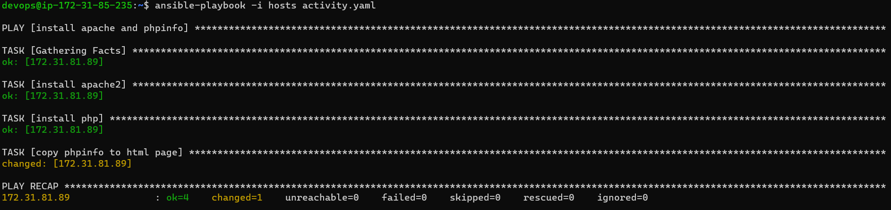
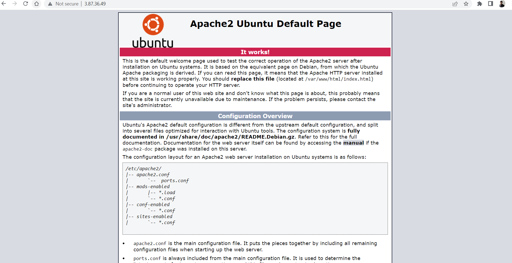
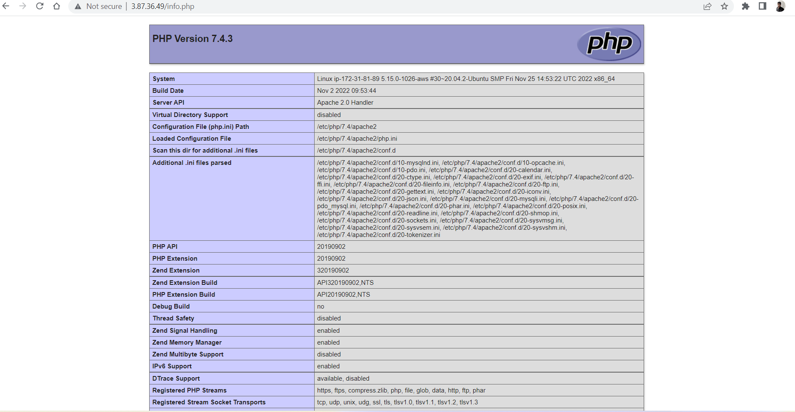

# To Install Linux, Apache, MySQL, PHP (LAMP) stack on Ubuntu 20.04 using Ansible Deployment
--------------------------------------------------------------------------------------------
* to install any application on servers using ansible we write playbooks.
* Playbook is nothing but collection of tasks , it is wriiten in yaml language.
* For each task we use modules.

## Ansible setup
---------------
* to install Linux, Apache, MySQL, PHP (LAMP) stack on Ubuntu 20.04 using Ansible Deployment we need two servers.
     * one for Ansible control node
     * two for node
* on Ansible control node we need python and ansible installation.
* on ubuntu machines by default python is present.

* to install ansible we follow below steps
```yaml
sudo apt update
sudo apt install software-properties-common
sudo add-apt-repository --yes --update ppa:ansible/ansible
sudo apt install ansible -y
``` 
```yaml
     export ANSIBLE_HOST_KEY_CHECKING=False
```
* to install Linux, Apache, MySQL, PHP (LAMP) stack on Ubuntu 20.04 we follow below steps
```yaml
   sudo apt update
   sudo apt install apache2
   sudo apt install php libapache2-mod-php php-mysql
   sudo nano /var/www/html/info.php
   <?php
   phpinfo();
   ?>
```
For above steps we write playbook for deployment using ansible.
```yaml
  ---
- name: install apache and phpinfo
  hosts: all
  become: yes
  tasks:
    - name: install apache2
      ansible.builtin.apt:
        name: apache2
        update_cache: yes
        state: present 
    - name: install php
      ansible.builtin.apt:
        name: 
          - php 
          - libapache2-mod-php 
          - php-mysql
        state: present    
    - name: copy phpinfo to html page
      ansible.builtin.copy:
        src: ./info.php
        dest: /var/www/html/info.php

```


