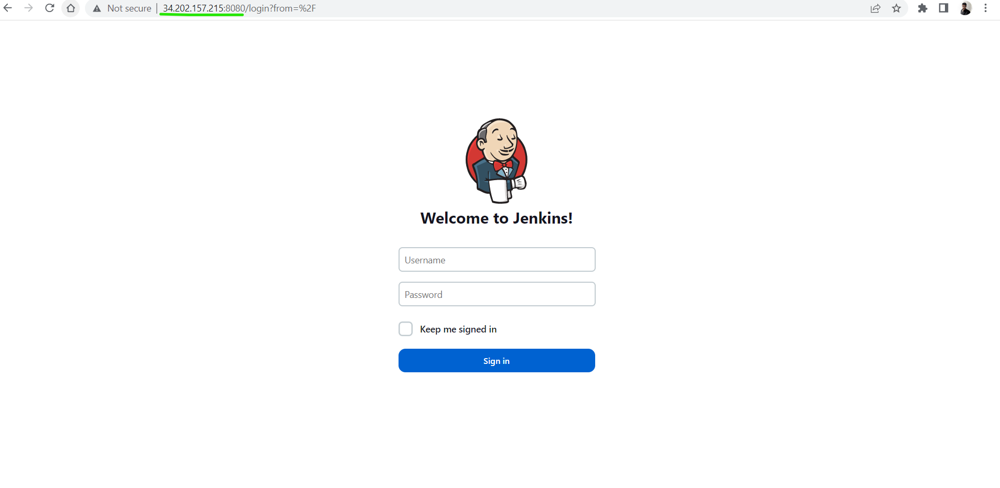
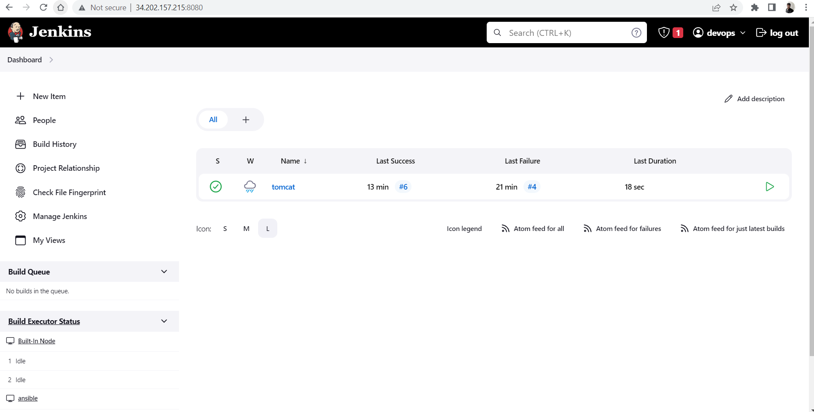
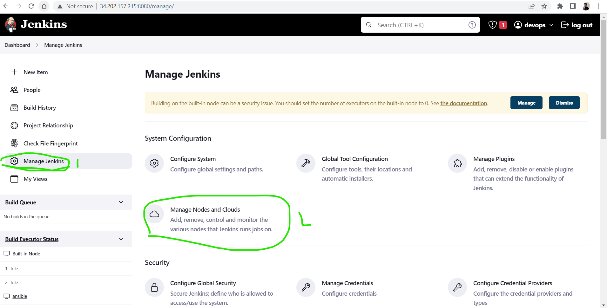
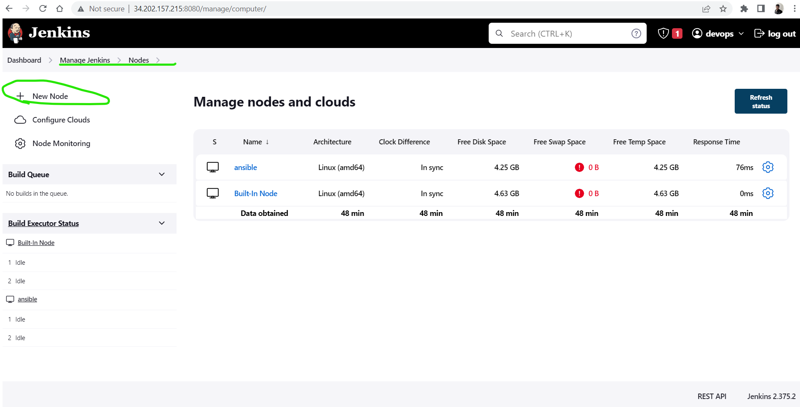

## How to configure ansible with Jenkins server
* To configure ansible with jenkins first we need two servers.
* one for Jenkins server and another one for Ansible.
* on Jenkins server we install jenkins. To install jenkins we follow the following steps.
```yaml
   sudo apt update
   sudo apt install openjdk-11-jdk -y
   curl -fsSL https://pkg.jenkins.io/debian-stable/jenkins.io.key | sudo tee \
    /usr/share/keyrings/jenkins-keyring.asc > /dev/null
   echo deb [signed-by=/usr/share/keyrings/jenkins-keyring.asc] \
    https://pkg.jenkins.io/debian-stable binary/ | sudo tee \
    /etc/apt/sources.list.d/jenkins.list > /dev/null
   sudo apt-get update
   sudo apt-get install jenkins -y
```
* on Ansible server to install ansible we follow the following steps.
```yaml
      sudo apt update
      sudo apt install software-properties-common
      sudo add-apt-repository --yes --update ppa:ansible/ansible
      sudo apt install ansible -y
```
* to configure ansible server with jenkins server we install java11 on ansible server.
* In jenkins, ansible server is node to the jenkins.
* to login into your jenkins server , you enter ipaddressofyourmachine:8080
* 
* to configure nodes in jenkins server, you can go the manage jenkins --> Manage nodes and cloud --> new node in Jenkins Dashdoard.



* By using jenkins server, we can create CI/CD Pipelins.In jenkins server, we write Jenkinsfile to create ci/cd pipeline.
* a Jenkinsfile is a text file that contains the definition of a Jenkins Pipeline and is checked into source control. Consider the following Pipeline which implements a basic continuous delivery pipeline.
* ```yaml
    pipeline {
      agent any
      stages {
        stage('Build') {
            steps {
                echo 'Building..'
            }
        }
        stage('Test') {
            steps {
                echo 'Testing..'
            }
        }
        stage('Deploy') {
            steps {
                echo 'Deploying....'
            }
        }
    }
}
```
* to configure ansible node with jenkins server ,we write following Jenkinsfile.
```bash
    pipeline {
    agent { label 'ansible' }
    stages {
        stage('vcs') {
            steps {
                git url: 'https://github.com/Nagaraju11111/ansible.git',
                    branch: 'master'
            }
        }
        stage('ansible') {
            steps {
                sh 'ansible-playbook -i ./tomcat2/hosts ./tomcat2/handlers.yaml'
            }
        }
    }
}
```